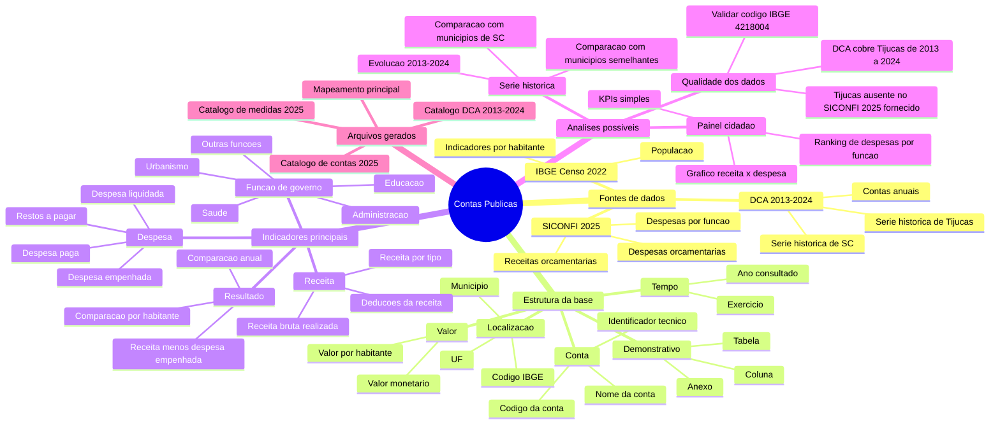

# Mapa Mental de Contas Publicas

Data: 2026-06-05

## Mapa Mental



## Notas Explicativas

### 1. Fontes de dados

O eixo de contas publicas usa duas familias de dados. A primeira e o SICONFI 2025, com receitas, despesas e despesas por funcao em arquivos tratados no formato parquet. A segunda e a DCA, ou Declaracao de Contas Anuais, que traz uma serie historica mais ampla, de 2013 a 2024.

O IBGE Censo 2022 entra como apoio para transformar valores totais em valores por habitante. Isso ajuda o cidadao a comparar municipios de tamanhos diferentes.

### 2. Estrutura da base

Cada registro combina localizacao, tempo, demonstrativo, conta e valor. Em termos praticos, a pergunta que cada linha responde e:

```text
quanto vale uma determinada conta publica, em um determinado ano, para um determinado municipio?
```

Na DCA, a chave analitica recomendada e:

```text
id_ente_consulta + an_exercicio_consulta + anexo + coluna + cod_conta + conta
```

### 3. Indicadores principais

Os indicadores mais importantes para uma leitura cidada sao:

- **Receita realizada**: quanto o municipio arrecadou ou registrou como receita no periodo.
- **Despesa empenhada**: quanto o municipio comprometeu oficialmente no orcamento.
- **Despesa liquidada**: quanto ja teve entrega ou direito reconhecido.
- **Despesa paga**: quanto efetivamente saiu do caixa.
- **Resultado orcamentario**: diferenca entre receita realizada e despesa empenhada.
- **Despesa por funcao**: mostra em quais areas o gasto se concentra, como saude, educacao e urbanismo.

### 4. Analises possiveis

Para um painel amigavel ao cidadao, o caminho mais claro e comecar por poucos indicadores:

1. Receita realizada.
2. Despesa empenhada, liquidada e paga.
3. Resultado orcamentario.
4. Despesa por funcao.
5. Valores por habitante.

Depois, a DCA permite enriquecer a leitura com serie historica e comparacoes com outros municipios de Santa Catarina.

### 5. Qualidade dos dados

O arquivo SICONFI 2025 fornecido nao trouxe registros para Tijucas/SC pelo codigo IBGE esperado, `4218004`. Por isso, o painel de 2025 depende de uma revisao da fonte ou de nova coleta.

Para Tijucas, a base historica DCA esta disponivel de 2013 a 2024, com 16.600 registros. Essa e a melhor fonte para iniciar uma visualizacao historica confiavel de contas publicas do municipio.

## Arquivos Relacionados

- `docs/mapeamento_variaveis_contas_publicas.md`
- `docs/catalogo_contas_publicas_siconfi_2025_medidas.csv`
- `docs/catalogo_contas_publicas_siconfi_2025_contas.csv`
- `docs/catalogo_contas_publicas_dca_sc_2013_2024_contas.csv`

